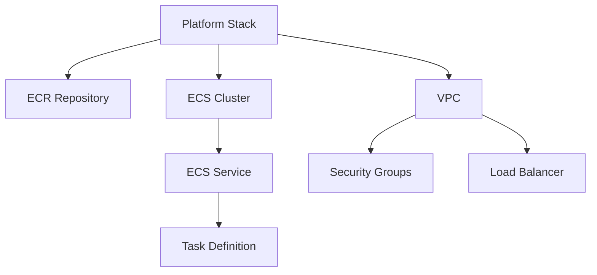

# Infrastructure Stacks

## Overview
This directory contains documentation for the CDK stacks used in the platform. Each stack is designed to be independent but can be composed together to create the complete infrastructure.

## Platform Stack

The main stack (`PlatformStack`) that creates the core infrastructure:

### Components
1. **Container Registry**
   - ECR repository for application images
   - Lifecycle rules for image cleanup
   - Push/pull permissions

2. **Container Infrastructure**
   - ECS Fargate cluster
   - Service definitions
   - Task definitions
   - Auto-scaling policies
   - Sample Flask application deployment

3. **Networking**
   - VPC with public/private subnets
   - NAT Gateway
   - Security groups
   - Load balancer

4. **Sample Application**
   - Flask application on port 3000
   - Health check endpoint (/health)
   - CloudWatch logging
   - Container insights
   - Auto-scaling based on CPU/Memory

### Application Configuration
```python
# Flask application settings
app_port = 3000
health_check_path = "/health"
container_cpu = 256
container_memory = 512
desired_count = 2
max_capacity = 4
min_capacity = 1
```

### Known Issues and Solutions

1. **ECR Repository Deletion**
   ```bash
   # Error: Cannot delete repository with images
   # Solution: Force delete with images
   aws ecr delete-repository --repository-name platform-repo --force
   ```

2. **Stack Deletion Failures**
   ```bash
   # Error: DELETE_FAILED state
   # Solution: Clean up resources in correct order
   1. Delete ECR images
   2. Delete ECR repository
   3. Delete ECS services
   4. Delete ECS tasks
   5. Delete stack
   ```

3. **Deployment Hangs**
   ```bash
   # Issue: Deployment stuck on IAM changes
   # Solution: Use non-interactive deployment
   cdk deploy --require-approval never
   ```

### Best Practices

1. **Resource Naming**
   ```python
   # Use consistent naming convention
   repository_name = f"{config.app_name}-repo"
   cluster_name = f"{config.app_name}-cluster"
   service_name = f"{config.app_name}-service"
   ```

2. **Resource Tags**
   ```python
   # Always tag resources for better management
   Tags.of(resource).add("Environment", config.environment)
   Tags.of(resource).add("Application", config.app_name)
   ```

3. **Security Groups**
   ```python
   # Minimize inbound rules
   security_group.add_ingress_rule(
       ec2.Peer.ipv4(vpc.vpc_cidr_block),
       ec2.Port.tcp(80),
       "Allow HTTP from VPC"
   )
   ```

## Stack Dependencies



## Deployment Order

1. Network resources
2. Security groups
3. ECR repository
4. ECS cluster
5. Task definitions
6. ECS service
7. Load balancer

## Cleanup Order

1. ECS service
2. Task definitions
3. ECR images
4. ECR repository
5. Load balancer
6. Security groups
7. Network resources

## Configuration

The stack uses environment variables for configuration:

```python
# Required environment variables
AWS_REGION = os.getenv("AWS_REGION")
AWS_ACCOUNT_ID = os.getenv("AWS_ACCOUNT_ID")
APP_NAME = os.getenv("APP_NAME", "platform")
ENVIRONMENT = os.getenv("ENVIRONMENT", "dev")
```

## Monitoring

1. **CloudWatch Metrics**
   - CPU utilization
   - Memory usage
   - Request count
   - Error rates

2. **Alarms**
   - High CPU/Memory
   - Service health
   - Error thresholds

## Security

1. **IAM Roles**
   - Task execution role
   - Task role
   - Service role

2. **Security Groups**
   - Load balancer rules
   - Container access
   - VPC endpoints 